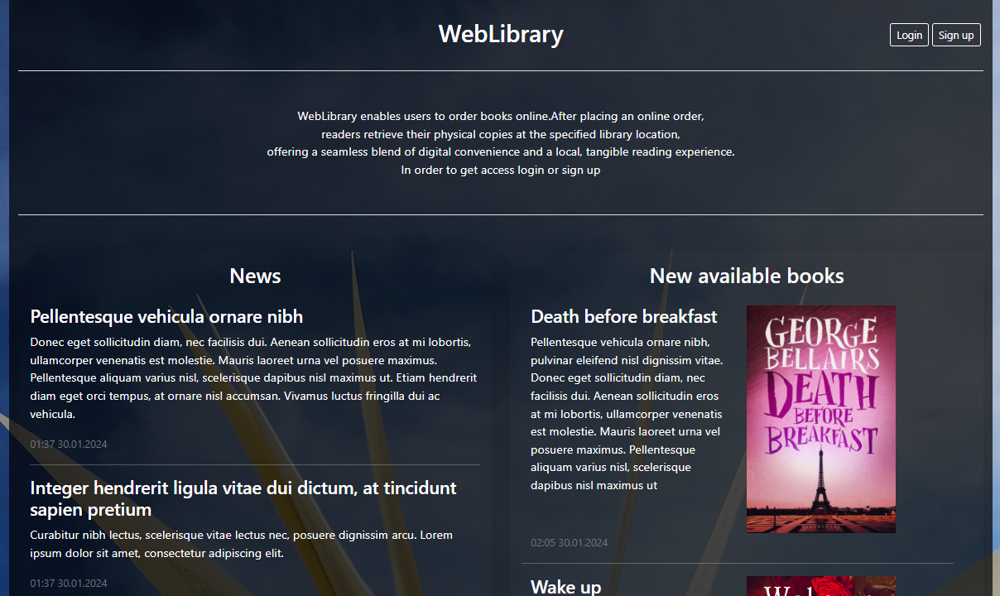
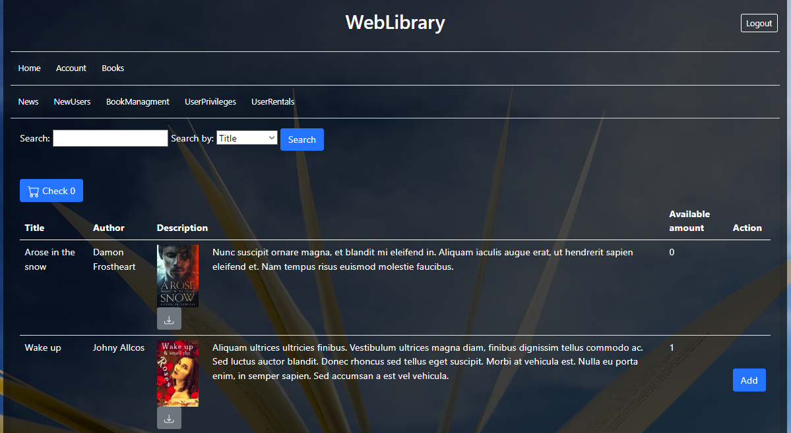

# WebLibrary

• Displaying a list of books. Cart with the ability to add and remove books. Ability to borrow books.
• Managing books in the administrative panel.
• Registration of readers. Confirmation of registration in the administrative panel
• Accounts for library staff. Employees can manage books, readers, and loans. Employees are managed by the administrator.
• Labels (tags) for books. Each book can be labeled with multiple tags. Browsing books by tags.
• Additional files to download with the book description. Each file has its description
• Searching for books based on title, author name, description.
• Browsing the reader's loan archive.
• Book inventory states. Automatic update of states when borrowing and returning books.
• Messages edited by the administrator and placed on the homepage.
• Displaying news (several recently added books) on the homepage.
• Password reminder send on e-mail and change procedure.
• Page with information about the logged user.
• Ability to create new roles and assign users

